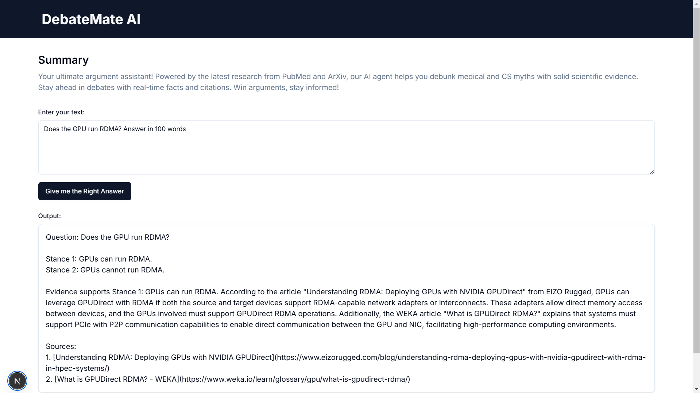

# **DebateMate AI**  

## 🧠 Win Arguments with Science!  

  

DebateMate AI is your personal argument assistant, helping you debunk myths in medicine and computer science using the latest research from **PubMed** and **ArXiv**. Whether you’re debating with friends or fact-checking claims, our AI provides real-time, evidence-backed responses.  

## 🖥️ Demo  
Check out how **DebateMate AI** works in action:  

🔗 **[Try it live](https://your-live-link.com)** 

## 🚀 Features  
- 📚 **Scientific Accuracy** – Sources from PubMed and ArXiv ensure reliable answers.  
- 🔍 **Real-Time Search** – Fetches the latest research papers to support your arguments.  
- 💬 **AI-Powered Responses** – Generates concise, research-backed replies.  
- 🎯 **Easy-to-Use Interface** – Enter a claim, and get a fact-checked response instantly.  

## 🛠 Technologies Used  
- **Node.js** – Backend logic and API development  
- **Express.js** – Lightweight and efficient web framework  
- **LangChain** – AI-powered text generation  
- **Selenium** – Fetching search results from semantic PubMed & ArXiv search engines  
- **Next.js** – Frontend for a smooth user experience  

## 📢 Contributing  
Want to improve DebateMate AI? Feel free to fork the repo, submit PRs, or open issues.  

## 🌐 Connect  
Have questions or suggestions? Reach out via [LinkedIn](https://www.linkedin.com/in/aditya-thaker2811).  
